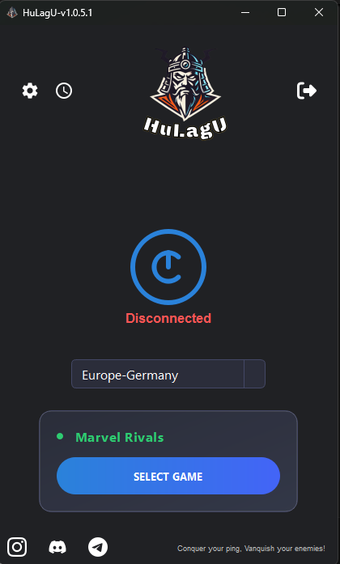
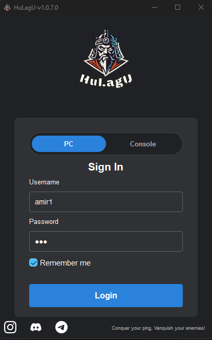
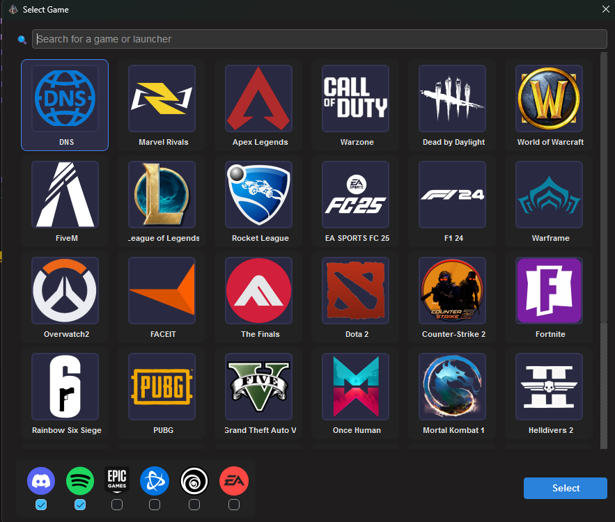

# هولاگو — بهینه‌ساز شبکه گیمینگ

**پینگت رو کاهش بده. تو بازی حاکم باش.**

**فارسی** | [**English**](README.md)

---

---

## هولاگو چیست؟

هولاگو یک نرم‌افزار دسکتاپ ویندوزی است که اتصال شبکه شما را به‌طور اختصاصی برای گیمینگ بهینه می‌کند. این برنامه ترافیک بازی شما را از طریق سرورهای پرسرعت مسیریابی می‌کند تا پینگ را کاهش دهد، پکت لاس را کم کند و اتصال را پایدار نگه دارد — تا در بازی‌های آنلاین مزیت رقابتی داشته باشید.

---

## تصاویر برنامه

| ورود | پنجره اصلی | انتخاب بازی |
|:-----:|:-----------:|:--------------:|
|  |  |  |

---

## ویژگی‌های کلیدی

- **تشخیص هوشمند بازی** — به‌صورت خودکار بازی‌های نصب‌شده شما را پیدا می‌کند، بدون نیاز به تنظیم دستی.
- **اتصال با یک کلیک** — با زدن دکمه پاور، ترافیک بازی شما فوری از سرورهای بهینه‌شده عبور می‌کند.
- **بیش از ۴۰ بازی پشتیبانی‌شده** — CS2، والورانت، دوتا ۲، پابجی، فورتنایت، اپکس، مارول رایولز و بسیاری دیگر.
- **پشتیبانی از لانچرها** — سازگار با Steam، Epic Games، Battle.net، EA App، Ubisoft Connect و دیگران.
- **وضعیت لحظه‌ای** — نشانگر بصری وضعیت اتصال را در هر لحظه نشان می‌دهد.
- **انتخاب منطقه** — منطقه سروری که به سرورهای بازی شما نزدیک‌تر است را انتخاب کنید.
- **حالت DNS** — بهینه‌سازی DNS برای بهبود بیشتر اتصال.
- **پشتیبانی کامل از زبان فارسی** — رابط کاربری کامل به زبان فارسی.

---

## بازی‌های پشتیبانی‌شده

| | | | | | |
|:---:|:---:|:---:|:---:|:---:|:---:|
| Counter-Strike 2 | Valorant | Dota 2 | PUBG | Fortnite | Apex Legends |
| Marvel Rivals | Warzone | Overwatch 2 | League of Legends | Rocket League | Rainbow Six Siege |
| World of Warcraft | Dead by Daylight | The Finals | FACEIT | GTA V | Warframe |
| Helldivers 2 | Mortal Kombat 1 | EA Sports FC 25 | F1 24 | FiveM | Battlefield 1 |
| Battlefield V | Red Dead Redemption 2 | Lost Ark | Once Human | Hunt: Showdown | ARK |
| Phasmophobia | Street Fighter 6 | Outlast Trials | ETS2 | For Honor | *و بیشتر...* |

---

## پیش‌نیازهای سیستم

| مورد | حداقل |
|---|---|
| سیستم‌عامل | ویندوز ۱۰ / ۱۱ (64-bit) |
| RAM | ۲ گیگابایت |
| فضای دیسک | ۱۵۰ مگابایت |
| اینترنت | اتصال فعال |
| حساب کاربری | حساب هولاگو (ثبت‌نام رایگان) |

---

## نصب

1. آخرین نسخه نصب‌کننده را از [صفحه GitHub Releases](https://github.com/AmirHossein143/HuLagU/releases/download/best_release/HuLagU_Setup.exe) یا [کانال تلگرام](https://t.me/hulaguservice) دانلود کنید.
2. فایل `HuLagU_Setup.exe` را اجرا کنید.
3. مراحل نصب را دنبال کنید.
4. هولاگو را باز کنید، با حساب کاربری‌تان وارد شوید و **Connect** را بزنید.

> **توجه:** برخی آنتی‌ویروس‌ها ممکن است نصب‌کننده را فلگ کنند. این یک اخطار اشتباه است — بخش [آنتی‌ویروس](#آنتیویروس--امنیت) را ببینید.

---

## نحوه کارکرد

1. **ورود** — با اطلاعات حساب هولاگو خود وارد شوید.
2. **انتخاب بازی** — هولاگو بازی‌های نصب‌شده را به‌صورت خودکار تشخیص می‌دهد. بازی موردنظر را انتخاب کنید.
3. **انتخاب منطقه** — منطقه سروری را که بهترین اتصال را به سرورهای بازی می‌دهد انتخاب کنید.
4. **اتصال** — دکمه پاور را بزنید. هولاگو ترافیک بازی شما را از طریق یک تونل بهینه‌شده با WireSock (مبتنی بر WireGuard) هدایت می‌کند.
5. **بازی کنید** — بازی را باز کنید و از پینگ پایین‌تر و پایدارتر لذت ببرید.

---

## آنتی‌ویروس و امنیت

برخی آنتی‌ویروس‌ها ممکن است هولاگو را فلگ کنند، چون این برنامه:

- سیستم فایل را برای پیدا کردن بازی‌های نصب‌شده اسکن می‌کند.
- تونل‌های شبکه ایجاد و مدیریت می‌کند (از طریق WireSock / WireGuard).
- قوانین مسیریابی شبکه را در حین اتصال تغییر می‌دهد.

این رفتارهای عادی هر نرم‌افزار بهینه‌ساز شبکه گیمینگ هستند. هولاگو **نمی‌کند**:

- داده شخصی فراتر از نیاز حساب کاربری جمع‌آوری کند.
- به فایل‌هایی غیر از بازی دسترسی داشته باشد.
- فایل‌های سیستمی خارج از تنظیمات شبکه را تغییر دهد.
- فعالیت مرور اینترنت شما را رصد کند.

ما از رمزگذاری استاندارد WireGuard برای تمام ترافیک تونل استفاده می‌کنیم.

### افزودن هولاگو به استثناهای آنتی‌ویروس

**Windows Defender:**
`Windows Security → Virus & threat protection → Manage settings → Add or remove exclusions → پوشه نصب هولاگو را اضافه کنید`

**سایر آنتی‌ویروس‌ها:**
در تنظیمات آنتی‌ویروس بخش "Exceptions" یا "Exclusions" را پیدا کنید و پوشه نصب هولاگو (پیش‌فرض: `C:\Program Files\HuLagU`) را اضافه کنید.

---

## ابزارها و تکنولوژی‌های استفاده‌شده

| تکنولوژی | نقش |
|---|---|
| **Python 3** | زبان اصلی برنامه |
| **PySide6 (Qt)** | فریم‌ورک رابط کاربری دسکتاپ |
| **WireSock / WireGuard** | تونل‌سازی شبکه رمزگذاری‌شده |
| **Flask** | API بک‌اند |
| **PyInstaller** | تبدیل به فایل اجرایی مستقل |
| **Inno Setup** | ساخت نصب‌کننده ویندوز |

---

## پشتیبانی

- **تلگرام پشتیبانی:** [@HuLagUsupport](https://t.me/HuLagUsupport)
- **کانال تلگرام:** [@hulaguservice](https://t.me/hulaguservice)
- **ربات تلگرام:** [@HuLagUbot](https://t.me/HuLagUbot)
- **دیسکورد:** [عضویت در سرور](https://discord.gg/HuLagU)

---

## افزودن تصاویر

برای نمایش تصاویر در این README، عکس‌ها را در پوشه `docs/screenshots/` با این نام‌های دقیق ذخیره کنید:

| فایل | محتوا |
|---|---|
| `docs/screenshots/login.png` | صفحه ورود |
| `docs/screenshots/main_window.png` | پنجره اصلی برنامه |
| `docs/screenshots/game_selection.png` | دیالوگ انتخاب بازی |

سپس فایل‌ها را به مخزن push کنید — تصاویر به‌صورت خودکار در README بالا نمایش داده می‌شوند.

---

*پینگت رو فتح کن، دشمنت رو شکست بده!*

